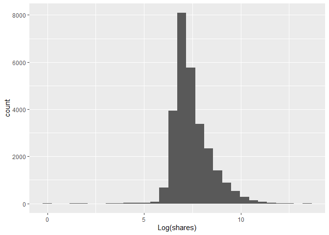

ST558 Project 2
================
Yu Jiang
7/3/2020

# Introduction

## Describe the Data

Many articles have been published by Mashable over two years from
seventh Jan, 2013 and this original dataset can be found [this
website](https://archive.ics.uci.edu/ml/datasets/Online+News+Popularity).

There are 61 variables in total from the dataset above: 58 predictive
attributes, 2 non-predictive and 1 goal field. More details about used
data will be discussed later.

## the Purpose of Analysis

We are interested in predicting the popularity of a given article and
thus we are going to treat *shares*, an index of the article popularity,
as the response of models and some other variables as predictors.

After fitting the linear and ensemble models respectively, we can choose
the best two different types of models by comparing some numeric values,
like AIC and BIC, and then we can make a conclusion about *shares*.

## Methods

First, we can slice data into two sets, a training set (70% of the data)
and the test set (30% of the data) and then we are going to start the
model fit.

Second, we are going to consider two types of models.

For the linear regression model, We will try to predict popularity in
two ways. The first target is as it is recorded, as the number of times
the articles is shared over the period. The second target is a binary
variable which discretizes the above. Following Fernandes et
al. (section 3.1), an article is considered popular if it exceeds 1400
shares. Therefore, we are going to use the threshold of 1400 shares to
create two classes: if the number of shares is greater than 1400, then
the article is classified as popular; if the number of shares is less
than or equal to 1400, then the article is classified as unpopular in
order to formulate a classification problem.

We are going to use multiple linear regression for the first task and
binary logistic regression for the second one.

For the ensemble models, we will also fit the two different
models(bagged trees and boosted trees) and choose the best one after
comparing the misclassification rate.

Finally, we will decide the best two different types of models for our
target.

# Data Study

## Description of the Used Data

Since we are going to predict the popularity of an article, we have
chosen *shares* as the response. To start with, for the linear
regression model, I am going to fit the model with some selected
predictors.

Similarly, for the ensemble model, I am also going to start to fit two
models (bagged tree and boosted tree) with selected predictors from the
train set. After comparing the misclassification rate, the best model
can be chosen.

## Data Split

``` r
# Load the all libraries and set seed for reproducibility
library(tidyverse)
library(ggplot2)
library(caret)
library(randomForest)
library(tree)
library(gbm)
library(rmarkdown)

set.seed(2)

# Read data and remove the first two columns since they are non-predictive.

news_pop <- read_csv('OnlineNewsPopularity.csv')[, -c(1, 2)]

params$weekday
```

    ## [1] "weekday_is_monday"

``` r
# Just consider 'Monday' at first 
dat<- news_pop %>% select(!starts_with('weekday_is_'), params$weekday)

# Check if the data has any missing values
sum(is.na(dat))
```

    ## [1] 0

Since there is no missing data for this dataset, we can slice the data
into the train and the test sets, respectively.

``` r
# Split the 'Monday' data, 70% of the data for training and the rest for testing
train <- sample(1:nrow(dat), size = nrow(dat) * 0.7)
test <- dplyr::setdiff(1:nrow(dat), train)

TrainDat <- dat[train, ]
TestDat <- dat[test, ]
```

## Data Summarizations

After splicing the data into two sets, we can explore the response
variable, *shares* and predictors.

### Response Variable

``` r
# Histogram of 'shares'
ggplot(data = TrainDat, aes(x = shares)) +
  geom_histogram()
```

<!-- -->

Since the histogram of share is highly skewed, we can consider to use
the log transformation to obtain a new histogram for shares.

``` r
x <- log(TrainDat$shares)

ggplot(data = TrainDat, aes(x)) +
  geom_histogram() + 
  xlab('Log(shares)')
```

<!-- -->

After comparing these two histograms, we decide to use the log(shares)
as our response for the multiple linear regression model.

### Predictor Variables

``` r
summary(TrainDat)
```

    ##  n_tokens_title n_tokens_content n_unique_tokens    n_non_stop_words  
    ##  Min.   : 3.0   Min.   :   0.0   Min.   :  0.0000   Min.   :   0.000  
    ##  1st Qu.: 9.0   1st Qu.: 245.0   1st Qu.:  0.4711   1st Qu.:   1.000  
    ##  Median :10.0   Median : 408.0   Median :  0.5401   Median :   1.000  
    ##  Mean   :10.4   Mean   : 544.2   Mean   :  0.5569   Mean   :   1.009  
    ##  3rd Qu.:12.0   3rd Qu.: 716.0   3rd Qu.:  0.6097   3rd Qu.:   1.000  
    ##  Max.   :20.0   Max.   :8474.0   Max.   :701.0000   Max.   :1042.000  
    ##  n_non_stop_unique_tokens   num_hrefs      num_self_hrefs       num_imgs      
    ##  Min.   :  0.0000         Min.   :  0.00   Min.   :  0.000   Min.   :  0.000  
    ##  1st Qu.:  0.6259         1st Qu.:  4.00   1st Qu.:  1.000   1st Qu.:  1.000  
    ##  Median :  0.6911         Median :  7.00   Median :  3.000   Median :  1.000  
    ##  Mean   :  0.6973         Mean   : 10.86   Mean   :  3.282   Mean   :  4.547  
    ##  3rd Qu.:  0.7553         3rd Qu.: 13.00   3rd Qu.:  4.000   3rd Qu.:  4.000  
    ##  Max.   :650.0000         Max.   :304.00   Max.   :116.000   Max.   :128.000  
    ##    num_videos    average_token_length  num_keywords   
    ##  Min.   : 0.00   Min.   :0.000        Min.   : 1.000  
    ##  1st Qu.: 0.00   1st Qu.:4.477        1st Qu.: 6.000  
    ##  Median : 0.00   Median :4.664        Median : 7.000  
    ##  Mean   : 1.25   Mean   :4.552        Mean   : 7.224  
    ##  3rd Qu.: 1.00   3rd Qu.:4.854        3rd Qu.: 9.000  
    ##  Max.   :91.00   Max.   :8.042        Max.   :10.000  
    ##  data_channel_is_lifestyle data_channel_is_entertainment data_channel_is_bus
    ##  Min.   :0.00000           Min.   :0.0000                Min.   :0.0000     
    ##  1st Qu.:0.00000           1st Qu.:0.0000                1st Qu.:0.0000     
    ##  Median :0.00000           Median :0.0000                Median :0.0000     
    ##  Mean   :0.05283           Mean   :0.1791                Mean   :0.1567     
    ##  3rd Qu.:0.00000           3rd Qu.:0.0000                3rd Qu.:0.0000     
    ##  Max.   :1.00000           Max.   :1.0000                Max.   :1.0000     
    ##  data_channel_is_socmed data_channel_is_tech data_channel_is_world
    ##  Min.   :0.0000         Min.   :0.0000       Min.   :0.0000       
    ##  1st Qu.:0.0000         1st Qu.:0.0000       1st Qu.:0.0000       
    ##  Median :0.0000         Median :0.0000       Median :0.0000       
    ##  Mean   :0.0582         Mean   :0.1855       Mean   :0.2117       
    ##  3rd Qu.:0.0000         3rd Qu.:0.0000       3rd Qu.:0.0000       
    ##  Max.   :1.0000         Max.   :1.0000       Max.   :1.0000       
    ##    kw_min_min       kw_max_min       kw_avg_min        kw_min_max    
    ##  Min.   : -1.00   Min.   :     0   Min.   :   -1.0   Min.   :     0  
    ##  1st Qu.: -1.00   1st Qu.:   445   1st Qu.:  141.3   1st Qu.:     0  
    ##  Median : -1.00   Median :   657   Median :  234.5   Median :  1400  
    ##  Mean   : 26.36   Mean   :  1158   Mean   :  313.5   Mean   : 13686  
    ##  3rd Qu.:  4.00   3rd Qu.:  1000   3rd Qu.:  356.4   3rd Qu.:  7900  
    ##  Max.   :377.00   Max.   :298400   Max.   :42827.9   Max.   :843300  
    ##    kw_max_max       kw_avg_max       kw_min_avg     kw_max_avg    
    ##  Min.   :     0   Min.   :     0   Min.   :  -1   Min.   :     0  
    ##  1st Qu.:843300   1st Qu.:172494   1st Qu.:   0   1st Qu.:  3560  
    ##  Median :843300   Median :243933   Median :1019   Median :  4355  
    ##  Mean   :751158   Mean   :258434   Mean   :1117   Mean   :  5653  
    ##  3rd Qu.:843300   3rd Qu.:329894   3rd Qu.:2061   3rd Qu.:  6015  
    ##  Max.   :843300   Max.   :843300   Max.   :3613   Max.   :298400  
    ##    kw_avg_avg    self_reference_min_shares self_reference_max_shares
    ##  Min.   :    0   Min.   :     0            Min.   :     0           
    ##  1st Qu.: 2380   1st Qu.:   642            1st Qu.:  1100           
    ##  Median : 2869   Median :  1200            Median :  2900           
    ##  Mean   : 3135   Mean   :  4057            Mean   : 10326           
    ##  3rd Qu.: 3600   3rd Qu.:  2700            3rd Qu.:  8100           
    ##  Max.   :43568   Max.   :843300            Max.   :843300           
    ##  self_reference_avg_sharess   is_weekend         LDA_00       
    ##  Min.   :     0.0           Min.   :0.0000   Min.   :0.00000  
    ##  1st Qu.:   985.4           1st Qu.:0.0000   1st Qu.:0.02505  
    ##  Median :  2200.0           Median :0.0000   Median :0.03339  
    ##  Mean   :  6451.3           Mean   :0.1312   Mean   :0.18397  
    ##  3rd Qu.:  5200.0           3rd Qu.:0.0000   3rd Qu.:0.24021  
    ##  Max.   :843300.0           Max.   :1.0000   Max.   :0.92000  
    ##      LDA_01            LDA_02            LDA_03            LDA_04       
    ##  Min.   :0.00000   Min.   :0.00000   Min.   :0.00000   Min.   :0.00000  
    ##  1st Qu.:0.02501   1st Qu.:0.02857   1st Qu.:0.02679   1st Qu.:0.02857  
    ##  Median :0.03335   Median :0.04000   Median :0.04000   Median :0.04073  
    ##  Mean   :0.14212   Mean   :0.21573   Mean   :0.22371   Mean   :0.23443  
    ##  3rd Qu.:0.15160   3rd Qu.:0.33048   3rd Qu.:0.37476   3rd Qu.:0.40546  
    ##  Max.   :0.92595   Max.   :0.92000   Max.   :0.92554   Max.   :0.92719  
    ##  global_subjectivity global_sentiment_polarity global_rate_positive_words
    ##  Min.   :0.0000      Min.   :-0.37500          Min.   :0.00000           
    ##  1st Qu.:0.3961      1st Qu.: 0.05758          1st Qu.:0.02841           
    ##  Median :0.4538      Median : 0.11947          Median :0.03904           
    ##  Mean   :0.4438      Mean   : 0.11940          Mean   :0.03965           
    ##  3rd Qu.:0.5086      3rd Qu.: 0.17801          3rd Qu.:0.05028           
    ##  Max.   :1.0000      Max.   : 0.72784          Max.   :0.15549           
    ##  global_rate_negative_words rate_positive_words rate_negative_words
    ##  Min.   :0.000000           Min.   :0.0000      Min.   :0.0000     
    ##  1st Qu.:0.009579           1st Qu.:0.6000      1st Qu.:0.1857     
    ##  Median :0.015353           Median :0.7108      Median :0.2800     
    ##  Mean   :0.016630           Mean   :0.6828      Mean   :0.2882     
    ##  3rd Qu.:0.021739           3rd Qu.:0.8000      3rd Qu.:0.3846     
    ##  Max.   :0.162037           Max.   :1.0000      Max.   :1.0000     
    ##  avg_positive_polarity min_positive_polarity max_positive_polarity
    ##  Min.   :0.0000        Min.   :0.00000       Min.   :0.0000       
    ##  1st Qu.:0.3062        1st Qu.:0.05000       1st Qu.:0.6000       
    ##  Median :0.3586        Median :0.10000       Median :0.8000       
    ##  Mean   :0.3543        Mean   :0.09583       Mean   :0.7576       
    ##  3rd Qu.:0.4114        3rd Qu.:0.10000       3rd Qu.:1.0000       
    ##  Max.   :1.0000        Max.   :1.00000       Max.   :1.0000       
    ##  avg_negative_polarity min_negative_polarity max_negative_polarity
    ##  Min.   :-1.0000       Min.   :-1.0000       Min.   :-1.0000      
    ##  1st Qu.:-0.3294       1st Qu.:-0.7000       1st Qu.:-0.1250      
    ##  Median :-0.2539       Median :-0.5000       Median :-0.1000      
    ##  Mean   :-0.2602       Mean   :-0.5228       Mean   :-0.1079      
    ##  3rd Qu.:-0.1873       3rd Qu.:-0.3000       3rd Qu.:-0.0500      
    ##  Max.   : 0.0000       Max.   : 0.0000       Max.   : 0.0000      
    ##  title_subjectivity title_sentiment_polarity abs_title_subjectivity
    ##  Min.   :0.0000     Min.   :-1.00000         Min.   :0.0000        
    ##  1st Qu.:0.0000     1st Qu.: 0.00000         1st Qu.:0.1667        
    ##  Median :0.1500     Median : 0.00000         Median :0.5000        
    ##  Mean   :0.2831     Mean   : 0.07075         Mean   :0.3411        
    ##  3rd Qu.:0.5000     3rd Qu.: 0.15000         3rd Qu.:0.5000        
    ##  Max.   :1.0000     Max.   : 1.00000         Max.   :0.5000        
    ##  abs_title_sentiment_polarity     shares       weekday_is_monday
    ##  Min.   :0.0000               Min.   :     1   Min.   :0.0000   
    ##  1st Qu.:0.0000               1st Qu.:   949   1st Qu.:0.0000   
    ##  Median :0.0000               Median :  1400   Median :0.0000   
    ##  Mean   :0.1565               Mean   :  3444   Mean   :0.1663   
    ##  3rd Qu.:0.2500               3rd Qu.:  2800   3rd Qu.:0.0000   
    ##  Max.   :1.0000               Max.   :690400   Max.   :1.0000

From the output above, we can remove the variable *is\_weekend* since it
seems to be duplicating days of week; five *LDA* variables due to
meaningless values and *kw\_min\_min, kw\_avg\_min, kw\_min\_avg*
because of negative values. We can obtain a new train and a test set
below.

``` r
# A new train and a test set
TrainDat <- TrainDat %>% select(!starts_with('LDA_'), -c(is_weekend, kw_min_min, kw_avg_min, kw_min_avg))

TestDat <- TestDat %>% select(!starts_with('LDA_'), -c(is_weekend, kw_min_min, kw_avg_min, kw_min_avg))

head(TrainDat)
```

    ## # A tibble: 6 x 44
    ##   n_tokens_title n_tokens_content n_unique_tokens n_non_stop_words
    ##            <dbl>            <dbl>           <dbl>            <dbl>
    ## 1              7              802           0.502             1.00
    ## 2             14             1193           0.411             1.00
    ## 3             11              147           0.760             1.00
    ## 4              9              206           0.629             1.00
    ## 5              8               60           0.814             1.00
    ## 6              8               79           0.861             1.00
    ## # ... with 40 more variables: n_non_stop_unique_tokens <dbl>, num_hrefs <dbl>,
    ## #   num_self_hrefs <dbl>, num_imgs <dbl>, num_videos <dbl>,
    ## #   average_token_length <dbl>, num_keywords <dbl>,
    ## #   data_channel_is_lifestyle <dbl>, data_channel_is_entertainment <dbl>,
    ## #   data_channel_is_bus <dbl>, data_channel_is_socmed <dbl>,
    ## #   data_channel_is_tech <dbl>, data_channel_is_world <dbl>, kw_max_min <dbl>,
    ## #   kw_min_max <dbl>, kw_max_max <dbl>, kw_avg_max <dbl>, kw_max_avg <dbl>,
    ## #   kw_avg_avg <dbl>, self_reference_min_shares <dbl>,
    ## #   self_reference_max_shares <dbl>, self_reference_avg_sharess <dbl>,
    ## #   global_subjectivity <dbl>, global_sentiment_polarity <dbl>,
    ## #   global_rate_positive_words <dbl>, global_rate_negative_words <dbl>,
    ## #   rate_positive_words <dbl>, rate_negative_words <dbl>,
    ## #   avg_positive_polarity <dbl>, min_positive_polarity <dbl>,
    ## #   max_positive_polarity <dbl>, avg_negative_polarity <dbl>,
    ## #   min_negative_polarity <dbl>, max_negative_polarity <dbl>,
    ## #   title_subjectivity <dbl>, title_sentiment_polarity <dbl>,
    ## #   abs_title_subjectivity <dbl>, abs_title_sentiment_polarity <dbl>,
    ## #   shares <dbl>, weekday_is_monday <dbl>

``` r
head(TestDat)
```

    ## # A tibble: 6 x 44
    ##   n_tokens_title n_tokens_content n_unique_tokens n_non_stop_words
    ##            <dbl>            <dbl>           <dbl>            <dbl>
    ## 1              9              531           0.504             1.00
    ## 2              8              960           0.418             1.00
    ## 3             12              989           0.434             1.00
    ## 4             11               97           0.670             1.00
    ## 5              8             1118           0.512             1.00
    ## 6              8              397           0.625             1.00
    ## # ... with 40 more variables: n_non_stop_unique_tokens <dbl>, num_hrefs <dbl>,
    ## #   num_self_hrefs <dbl>, num_imgs <dbl>, num_videos <dbl>,
    ## #   average_token_length <dbl>, num_keywords <dbl>,
    ## #   data_channel_is_lifestyle <dbl>, data_channel_is_entertainment <dbl>,
    ## #   data_channel_is_bus <dbl>, data_channel_is_socmed <dbl>,
    ## #   data_channel_is_tech <dbl>, data_channel_is_world <dbl>, kw_max_min <dbl>,
    ## #   kw_min_max <dbl>, kw_max_max <dbl>, kw_avg_max <dbl>, kw_max_avg <dbl>,
    ## #   kw_avg_avg <dbl>, self_reference_min_shares <dbl>,
    ## #   self_reference_max_shares <dbl>, self_reference_avg_sharess <dbl>,
    ## #   global_subjectivity <dbl>, global_sentiment_polarity <dbl>,
    ## #   global_rate_positive_words <dbl>, global_rate_negative_words <dbl>,
    ## #   rate_positive_words <dbl>, rate_negative_words <dbl>,
    ## #   avg_positive_polarity <dbl>, min_positive_polarity <dbl>,
    ## #   max_positive_polarity <dbl>, avg_negative_polarity <dbl>,
    ## #   min_negative_polarity <dbl>, max_negative_polarity <dbl>,
    ## #   title_subjectivity <dbl>, title_sentiment_polarity <dbl>,
    ## #   abs_title_subjectivity <dbl>, abs_title_sentiment_polarity <dbl>,
    ## #   shares <dbl>, weekday_is_monday <dbl>

# Modeling

## Linear Regression Fit

### Multiple Linear Regression

We are going to fit the multiple linear regression with selected
predictors.

``` r
# Multiple linear model
fit <- lm(log(shares) ~ . , data = TrainDat)
summary(fit)
```

    ## 
    ## Call:
    ## lm(formula = log(shares) ~ ., data = TrainDat)
    ## 
    ## Residuals:
    ##     Min      1Q  Median      3Q     Max 
    ## -8.1084 -0.5564 -0.1654  0.3988  5.6531 
    ## 
    ## Coefficients:
    ##                                 Estimate Std. Error t value Pr(>|t|)    
    ## (Intercept)                    6.743e+00  6.144e-02 109.743  < 2e-16 ***
    ## n_tokens_title                 5.726e-03  2.624e-03   2.183 0.029077 *  
    ## n_tokens_content               6.479e-05  2.067e-05   3.135 0.001722 ** 
    ## n_unique_tokens                2.253e-01  1.752e-01   1.286 0.198391    
    ## n_non_stop_words              -1.645e-02  5.923e-02  -0.278 0.781241    
    ## n_non_stop_unique_tokens      -2.139e-01  1.486e-01  -1.439 0.150127    
    ## num_hrefs                      4.340e-03  6.064e-04   7.157 8.47e-13 ***
    ## num_self_hrefs                -8.936e-03  1.651e-03  -5.412 6.29e-08 ***
    ## num_imgs                       1.943e-03  8.144e-04   2.385 0.017070 *  
    ## num_videos                     1.081e-03  1.417e-03   0.763 0.445391    
    ## average_token_length          -9.488e-02  2.170e-02  -4.372 1.23e-05 ***
    ## num_keywords                   2.400e-02  3.292e-03   7.291 3.15e-13 ***
    ## data_channel_is_lifestyle     -4.414e-02  2.964e-02  -1.489 0.136412    
    ## data_channel_is_entertainment -2.261e-01  2.204e-02 -10.257  < 2e-16 ***
    ## data_channel_is_bus            9.383e-04  2.371e-02   0.040 0.968427    
    ## data_channel_is_socmed         2.473e-01  2.917e-02   8.480  < 2e-16 ***
    ## data_channel_is_tech           1.387e-01  2.349e-02   5.905 3.57e-09 ***
    ## data_channel_is_world         -1.457e-01  2.490e-02  -5.851 4.95e-09 ***
    ## kw_max_min                    -3.377e-06  1.705e-06  -1.980 0.047673 *  
    ## kw_min_max                    -3.891e-07  1.051e-07  -3.703 0.000214 ***
    ## kw_max_max                    -1.685e-07  3.473e-08  -4.850 1.24e-06 ***
    ## kw_avg_max                    -3.164e-07  7.337e-08  -4.312 1.62e-05 ***
    ## kw_max_avg                    -3.435e-05  2.004e-06 -17.141  < 2e-16 ***
    ## kw_avg_avg                     2.872e-04  9.928e-06  28.933  < 2e-16 ***
    ## self_reference_min_shares      1.099e-06  6.808e-07   1.615 0.106419    
    ## self_reference_max_shares      2.876e-07  3.722e-07   0.773 0.439580    
    ## self_reference_avg_sharess     6.367e-07  9.468e-07   0.673 0.501266    
    ## global_subjectivity            4.064e-01  7.758e-02   5.239 1.63e-07 ***
    ## global_sentiment_polarity     -2.462e-01  1.536e-01  -1.602 0.109086    
    ## global_rate_positive_words    -4.505e-01  6.608e-01  -0.682 0.495343    
    ## global_rate_negative_words    -6.860e-01  1.276e+00  -0.538 0.590735    
    ## rate_positive_words            2.684e-01  1.292e-01   2.077 0.037851 *  
    ## rate_negative_words            2.075e-01  1.466e-01   1.415 0.157045    
    ## avg_positive_polarity          1.021e-01  1.257e-01   0.813 0.416511    
    ## min_positive_polarity         -4.563e-01  1.039e-01  -4.391 1.13e-05 ***
    ## max_positive_polarity         -1.796e-02  3.947e-02  -0.455 0.649077    
    ## avg_negative_polarity         -2.128e-01  1.151e-01  -1.849 0.064400 .  
    ## min_negative_polarity          3.733e-02  4.202e-02   0.888 0.374322    
    ## max_negative_polarity         -3.387e-02  9.589e-02  -0.353 0.723896    
    ## title_subjectivity             5.729e-02  2.514e-02   2.278 0.022709 *  
    ## title_sentiment_polarity       9.188e-02  2.291e-02   4.011 6.07e-05 ***
    ## abs_title_subjectivity         1.173e-01  3.342e-02   3.510 0.000449 ***
    ## abs_title_sentiment_polarity   7.314e-03  3.617e-02   0.202 0.839778    
    ## weekday_is_monday              2.602e-03  1.428e-02   0.182 0.855450    
    ## ---
    ## Signif. codes:  0 '***' 0.001 '**' 0.01 '*' 0.05 '.' 0.1 ' ' 1
    ## 
    ## Residual standard error: 0.8836 on 27706 degrees of freedom
    ## Multiple R-squared:  0.1118, Adjusted R-squared:  0.1104 
    ## F-statistic: 81.12 on 43 and 27706 DF,  p-value: < 2.2e-16

### Binary Logistic Regression

Use *shares* to create the binary variable : diving the shares into two
groups (\<1400 and \>= 1400) and fit the model with the selected
predictors as well.

``` r
# Convert 'shares' into factor: <= 1400: unpopular, > 1400: popular
TrainDat$shares[TrainDat$shares <= 1400] <- 0
TrainDat$shares[TrainDat$shares > 1400] <- 1

TrainDat$shares <- as.factor(TrainDat$shares)
  
# GLM model
glmFit <- glm(shares~. , data = TrainDat, family = 'binomial')
summary(glmFit)
```

    ## 
    ## Call:
    ## glm(formula = shares ~ ., family = "binomial", data = TrainDat)
    ## 
    ## Deviance Residuals: 
    ##    Min      1Q  Median      3Q     Max  
    ## -4.380  -1.048  -0.674   1.078   1.904  
    ## 
    ## Coefficients:
    ##                                 Estimate Std. Error z value Pr(>|z|)    
    ## (Intercept)                   -1.420e+00  1.479e-01  -9.599  < 2e-16 ***
    ## n_tokens_title                -3.269e-03  6.264e-03  -0.522 0.601747    
    ## n_tokens_content               1.814e-04  5.198e-05   3.490 0.000484 ***
    ## n_unique_tokens               -7.811e-02  4.228e-01  -0.185 0.853419    
    ## n_non_stop_words               4.055e-01  1.452e-01   2.793 0.005220 ** 
    ## n_non_stop_unique_tokens      -5.543e-01  3.573e-01  -1.552 0.120770    
    ## num_hrefs                      9.057e-03  1.555e-03   5.826 5.67e-09 ***
    ## num_self_hrefs                -2.129e-02  3.979e-03  -5.350 8.81e-08 ***
    ## num_imgs                      -1.403e-04  1.974e-03  -0.071 0.943354    
    ## num_videos                    -2.210e-03  3.426e-03  -0.645 0.518827    
    ## average_token_length          -1.077e-01  5.180e-02  -2.079 0.037578 *  
    ## num_keywords                   6.298e-02  7.902e-03   7.969 1.59e-15 ***
    ## data_channel_is_lifestyle      1.298e-01  7.060e-02   1.838 0.066024 .  
    ## data_channel_is_entertainment -4.114e-01  5.237e-02  -7.855 4.00e-15 ***
    ## data_channel_is_bus            2.769e-01  5.657e-02   4.895 9.85e-07 ***
    ## data_channel_is_socmed         1.006e+00  7.328e-02  13.730  < 2e-16 ***
    ## data_channel_is_tech           6.449e-01  5.627e-02  11.460  < 2e-16 ***
    ## data_channel_is_world         -1.714e-01  5.962e-02  -2.874 0.004047 ** 
    ## kw_max_min                    -1.396e-06  5.065e-06  -0.276 0.782909    
    ## kw_min_max                    -8.186e-07  2.478e-07  -3.303 0.000956 ***
    ## kw_max_max                    -7.420e-07  8.293e-08  -8.948  < 2e-16 ***
    ## kw_avg_max                    -6.268e-07  1.763e-07  -3.555 0.000379 ***
    ## kw_max_avg                    -8.245e-05  5.318e-06 -15.504  < 2e-16 ***
    ## kw_avg_avg                     6.408e-04  2.576e-05  24.873  < 2e-16 ***
    ## self_reference_min_shares      3.181e-06  2.018e-06   1.576 0.114945    
    ## self_reference_max_shares      8.708e-07  9.738e-07   0.894 0.371194    
    ## self_reference_avg_sharess     7.605e-07  2.493e-06   0.305 0.760288    
    ## global_subjectivity            8.260e-01  1.859e-01   4.443 8.88e-06 ***
    ## global_sentiment_polarity     -3.856e-01  3.679e-01  -1.048 0.294504    
    ## global_rate_positive_words    -9.886e-01  1.579e+00  -0.626 0.531273    
    ## global_rate_negative_words     2.247e+00  3.079e+00   0.730 0.465473    
    ## rate_positive_words            1.945e-01  3.094e-01   0.629 0.529644    
    ## rate_negative_words           -1.533e-01  3.516e-01  -0.436 0.662847    
    ## avg_positive_polarity         -6.128e-02  3.009e-01  -0.204 0.838603    
    ## min_positive_polarity         -6.536e-01  2.488e-01  -2.627 0.008612 ** 
    ## max_positive_polarity         -1.658e-02  9.426e-02  -0.176 0.860397    
    ## avg_negative_polarity         -1.058e-01  2.760e-01  -0.383 0.701441    
    ## min_negative_polarity          8.469e-02  1.009e-01   0.839 0.401485    
    ## max_negative_polarity         -2.312e-01  2.299e-01  -1.006 0.314550    
    ## title_subjectivity             1.501e-01  6.041e-02   2.485 0.012938 *  
    ## title_sentiment_polarity       2.011e-01  5.518e-02   3.645 0.000268 ***
    ## abs_title_subjectivity         1.850e-01  8.019e-02   2.307 0.021068 *  
    ## abs_title_sentiment_polarity  -7.407e-02  8.702e-02  -0.851 0.394637    
    ## weekday_is_monday             -6.275e-02  3.408e-02  -1.841 0.065622 .  
    ## ---
    ## Signif. codes:  0 '***' 0.001 '**' 0.01 '*' 0.05 '.' 0.1 ' ' 1
    ## 
    ## (Dispersion parameter for binomial family taken to be 1)
    ## 
    ##     Null deviance: 38467  on 27749  degrees of freedom
    ## Residual deviance: 35510  on 27706  degrees of freedom
    ## AIC: 35598
    ## 
    ## Number of Fisher Scoring iterations: 7

### Linear Regression Model Comparsion

We are going to choose a better linear model from the multiple linear
model and the binary logistic regression model with comparing the values
of AIC and BIC respectively.

``` r
AIC(fit, glmFit)
```

    ##        df      AIC
    ## fit    45 71926.31
    ## glmFit 44 35598.05

``` r
BIC(fit, glmFit)
```

    ##        df      BIC
    ## fit    45 72296.71
    ## glmFit 44 35960.21

Since the binary logistic regression model has much smaller AIC and BIC
values, we can choose the binary logistic regression model.

## Ensemble model Fit

For the ensemble model fit, we are going to use the R machine learning
`caret` package.

### Bagged Tree

``` r
# Use ‘trainControl()‘ to control the computational nuances of the train method
trctrl <- trainControl(method = 'repeatedcv', number = 5, repeats = 2)

# Fit a bagged tree
baggedTree <- train(shares ~ ., data = TrainDat, trControl=trctrl,
preProcess = c("center", "scale"), method = "treebag")

baggedTree
```

    ## Bagged CART 
    ## 
    ## 27750 samples
    ##    43 predictor
    ##     2 classes: '0', '1' 
    ## 
    ## Pre-processing: centered (43), scaled (43) 
    ## Resampling: Cross-Validated (5 fold, repeated 2 times) 
    ## Summary of sample sizes: 22200, 22201, 22199, 22200, 22200, 22200, ... 
    ## Resampling results:
    ## 
    ##   Accuracy   Kappa    
    ##   0.6320903  0.2640796

``` r
# Convert 'shares' in mondayTest into factors as well
TestDat$shares[TestDat$shares <= 1400] <- 0
TestDat$shares[TestDat$shares > 1400] <- 1
TestDat$shares <- as.factor(TestDat$shares)

# Predict classes for test dataset
test_pred_baggedTree <- predict(baggedTree, newdata = TestDat)

# Accurary of the model
confusionMatrix(test_pred_baggedTree, TestDat$shares)
```

    ## Confusion Matrix and Statistics
    ## 
    ##           Reference
    ## Prediction    0    1
    ##          0 3838 2143
    ##          1 2222 3691
    ##                                           
    ##                Accuracy : 0.633           
    ##                  95% CI : (0.6243, 0.6417)
    ##     No Information Rate : 0.5095          
    ##     P-Value [Acc > NIR] : <2e-16          
    ##                                           
    ##                   Kappa : 0.2659          
    ##                                           
    ##  Mcnemar's Test P-Value : 0.2378          
    ##                                           
    ##             Sensitivity : 0.6333          
    ##             Specificity : 0.6327          
    ##          Pos Pred Value : 0.6417          
    ##          Neg Pred Value : 0.6242          
    ##              Prevalence : 0.5095          
    ##          Detection Rate : 0.3227          
    ##    Detection Prevalence : 0.5029          
    ##       Balanced Accuracy : 0.6330          
    ##                                           
    ##        'Positive' Class : 0               
    ## 

### Boosted Tree

``` r
# Fit a boosted tree
boostTree <- train(shares ~ ., data = TrainDat, distribution = "bernoulli",
                   method = "gbm", verbose = FALSE, trControl=trctrl)

# Predict classes for test dataset
test_pred_boostTree <- predict(boostTree, newdata = TestDat)

# Accurary of the model
confusionMatrix(test_pred_boostTree, TestDat$shares)
```

    ## Confusion Matrix and Statistics
    ## 
    ##           Reference
    ## Prediction    0    1
    ##          0 3948 1990
    ##          1 2112 3844
    ##                                           
    ##                Accuracy : 0.6551          
    ##                  95% CI : (0.6465, 0.6637)
    ##     No Information Rate : 0.5095          
    ##     P-Value [Acc > NIR] : < 2e-16         
    ##                                           
    ##                   Kappa : 0.3103          
    ##                                           
    ##  Mcnemar's Test P-Value : 0.05886         
    ##                                           
    ##             Sensitivity : 0.6515          
    ##             Specificity : 0.6589          
    ##          Pos Pred Value : 0.6649          
    ##          Neg Pred Value : 0.6454          
    ##              Prevalence : 0.5095          
    ##          Detection Rate : 0.3319          
    ##    Detection Prevalence : 0.4992          
    ##       Balanced Accuracy : 0.6552          
    ##                                           
    ##        'Positive' Class : 0               
    ## 

### Ensemble model Model Comparsion

We are going to choose a better ensemble model after comparing the
misclassification rate.

``` r
baggedTbl <- table(data.frame(pred = predict(baggedTree, TestDat), true = TestDat$shares))

boostTbl <- table(data.frame(pred = predict(boostTree, TestDat), true = TestDat$shares))

#misclassificatoon rate
1-c(bag = sum(diag(baggedTbl)/sum(baggedTbl)),
    boost = sum(diag(boostTbl)/sum(boostTbl)))
```

    ##       bag     boost 
    ## 0.3669918 0.3448798

Since the boosted trees model with a smaller misclassification rate
0.336 and a larger accuracy rate 0.665 than the bagged trees model, we
can choose the boosted trees model.

# Automation

# Conclusions

For the linear regression model, the binary logistic model is better
than the multiple linear regression model after comparing AIC and BIC
values.

For the chosen model, the binary logistic model, we can see that some
variables whose coefficients are positive need to be increased while the
rest variables whose coefficients are negative needs to be decreased.

For the ensemble model, the boosted tree model is the best one. This
gives highest accuracy around 65%. The data set on a whole gives average
accuracy around 64% which shows that the dataset is inconsistent
indicating that irrelevant information has been used.

Therefore, this dataset is insufficient to predict the number of shares
with high levels of accuracy for a news article considering its
popularity and thus more data needs to be collected.
